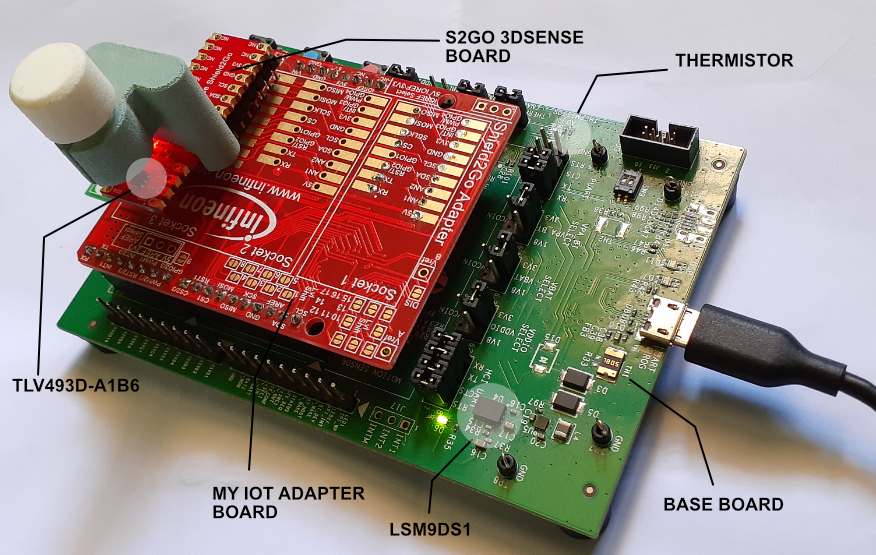
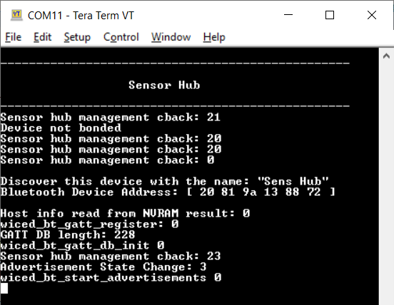
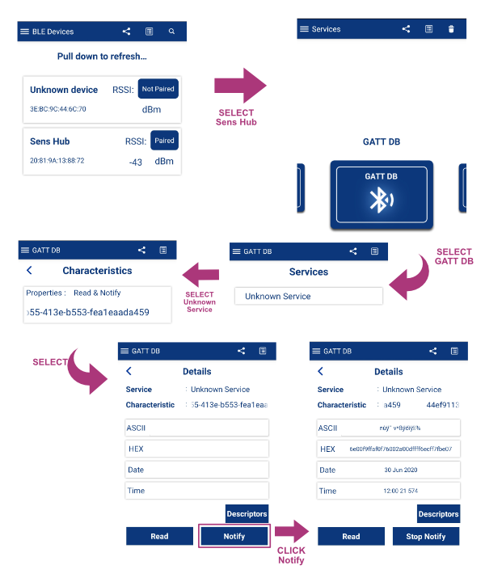
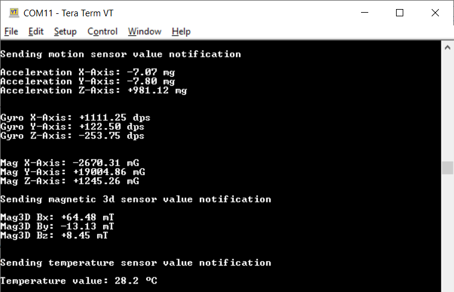
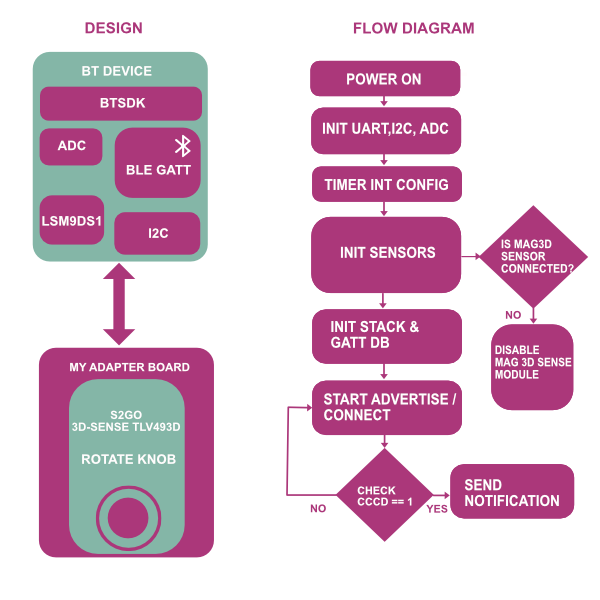

# Bluetooth; LE - SensorHub

This example demonstrates multiple sensors (motion sensor, 3D magnetic sensor, and thermistor) interfaced with AIROC™ CYW207xx and  CYW208xx Bluetooth® & Bluetooth® LE system on chips using ModusToolbox&trade; software.


## Requirements


    **Note:** This code example version requires ModusToolbox&trade; software version 2.2 or later and is not backward compatible with v2.1 or older versions. If you cannot move to ModusToolbox&trade; software v2.2, use the latest compatible 

- Programming language: C


## Supported toolchains (make variable 'TOOLCHAIN')

- GNU Arm® embedded compiler v9.3.1 (`GCC_ARM`) - Default value of `TOOLCHAIN`


## Hardware setup

This example uses the board's default configuration. See the kit user guide to ensure that the board is configured correctly.

The CYW20819 and CYW20719 baseboards come with a motion sensor and thermistor. Plug the 3D magnetic sensor shield board into the Arduino connector of the baseboards through the My IoT adapter board.

**Figure 1. Board setup**



## Software setup

Install a terminal emulator if you don't have one. Instructions in this document use [Tera term]. All other required software come bundled with the Eclipse IDE for ModusToolbox&trade; software.

To use a Windows PC as the Bluetooth&reg; LE Central device for the GATT Client application, install [CySmart host emulation tool]. You will also need [CY5677 CySmart Bluetooth&reg; LE 4.2 USB dongle]

To use an iOS or Android smartphone as the Bluetooth&reg; LE Central device, download the CySmart app. Scan the following QR codes from your mobile phone to download the CySmart app.


This example requires no additional software or tools.

## Using the code example

Create the project and open it using one of the following:

<details><summary><b>In Eclipse IDE for ModusToolbox&trade; software</b></summary>

1. Click the **New Application** link in the **Quick Panel** (or, use **File** > **New** > **ModusToolbox Application**). This launches the [Project Creator] tool.

2. Pick a kit supported by the code example from the list shown in the **Project Creator - Choose Board Support Package (BSP)** dialog.

   When you select a supported kit, the example is reconfigured automatically to work with the kit. To work with a different supported kit later, use the [Library Manager]to choose the BSP for the supported kit and deselect the other BSPs. Keep only the required BSP in your application. You can use the Library Manager to select or update the BSP and firmware libraries used in this application. To access the Library Manager, click the link from the **Quick Panel**.

   You can also just start the application creation process again and select a different kit.

   If you want to use the application for a kit not listed here, you may need to update the source files. If the kit does not have the required resources, the application may not work.
3. In the **Project Creator - Select Application** dialog, choose the **Bluetooth LE SensorHub** application by enabling the checkbox.

4. Optionally, change the suggested **New Application Name**.

5. The **Application(s) Root Path** defaults to the Eclipse workspace which is usually the desired location for the application. If you want to store the application in a different location, you can change the *Application(s) Root Path* value. Applications that share libraries should be in the same root path.

6. Click **Create** to complete the application creation process.

For more details, see the [Eclipse IDE for ModusToolbox&trade; software user guide] (locally available at *{ModusToolbox&trade; software install directory}/ide_{version}/docs/mt_ide_user_guide.pdf*).

</details>

<details><summary><b>In command-line interface (CLI)</b></summary>

ModusToolbox&trade; software provides the Project Creator as both a GUI tool and a command line tool, "project-creator-cli". The CLI tool can be used to create applications from a CLI terminal or from within batch files or shell scripts. This tool is available in the *{ModusToolbox&trade; software install directory}/tools_{version}/project-creator/* directory.

Use a CLI terminal to invoke the "project-creator-cli" tool. On Windows, use the command line "modus-shell" program provided in the ModusToolbox&trade; software installation instead of a standard Windows command-line application. This shell provides access to all ModusToolbox&trade; software tools. You can access it by typing `modus-shell` in the search box in the Windows menu. In Linux and macOS, you can use any terminal application.

The following table lists the arguments for this tool:

Argument | Description | Required/optional
---------|-------------|-----------
`--board-id` | Defined in the `<id>` field of the  manifest | Required
`--app-id`   | Defined in the `<id>` field of themanifest | Required
`--target-dir`| Specify the directory in which the application is to be created if you prefer not to use the default current working directory | Optional
`--user-app-name`| Specify the name of the application if you prefer to have a name other than the example's default name | Optional


The following example will clone the " application with the desired name "MyHelloWorld" configured for the *CY8CKIT-062-WIFI-BT* BSP into the specified working directory, *C:/mtb_projects*:

   ```
   project-creator-cli --board-id CY8CKIT-062-WIFI-BT --app-id mtb-example-psoc6-hello-world --user-app-name MyHelloWorld --target-dir "C:/mtb_projects"
   ```

**Note:** The project-creator-cli tool uses the `git clone` and `make getlibs` commands to fetch the repository and import the required libraries. For more details, see the "Project creator tools" section of the [ModusToolbox&trade; software  (locally available at *{ModusToolbox&trade; software install directory}/docs_{version}/mtb_user_guide.pdf*).

</details>

<details><summary><b>In third-party IDEs</b></summary>

Use one of the following options:


   1. Launch Project Creator from the Windows Start menu or from *{ModusToolbox&trade; software install directory}/tools_{version}/project-creator/project-creator.exe*.

   2. In the initial **Choose Board Support Package** screen, select the BSP and click **Next**.

   3. In the **Select Application** screen, select the appropriate IDE from the **Target IDE** drop-down menu.

   4. Click **Create** and follow the instructions printed in the bottom pane to import or open the exported project in the respective IDE.

- **Use command-line interface (CLI):**

   1. Follow the instructions from the **In command-line interface (CLI)** section to create the application, and import the libraries using the `make getlibs` command.

   2. Export the application to a supported IDE using the `make <ide>` command.

   3. Follow the instructions displayed in the terminal to create or import the application as an IDE project.

For a list of supported IDEs and more details, see the "Exporting to IDEs" section of the [ModusToolbox&trade; software user guide] (locally available at *{ModusToolbox&trade; software install directory}/docs_{version}/mtb_user_guide.pdf*).

</details>


## Operation

### Using the CySmart desktop application as Bluetooth&reg; LE Central:

1. Connect the board to your PC using the provided USB cable through the USB connector.

2. Open any serial terminal program and select the WICED PUART COM port. Set the serial port parameters to 8N1 and 115200 baud.

3. Program the board with the *mtb-example-btsdk-sensorhub* application.

      <details><summary><b>Using Eclipse IDE for ModusToolbox&trade; software</b></summary>

      1. Select the application project in the Project Explorer.

      2. In the **Quick Panel**, scroll down, and click **\<Application Name> Program**.
    </details>

     <details><summary><b>Using CLI</b></summary>

     From the terminal, execute the `make program` command to build and program the application using the default toolchain to the default target. The default toolchain and target are specified in the application's Makefile but you can override those values manually:
      ```
      make program TARGET=<BSP> TOOLCHAIN=<toolchain>
      ```
      Example:
      ```
      make program TARGET=CYW920819EVB-02 TOOLCHAIN=GCC_ARM
      ```
    </details>

4. After programming, the application starts automatically. Confirm that 'Bluetooth&reg; LE SensorHub' is displayed on the UART terminal and it will start advertising.

   **Figure 2. Terminal output for sensor hub during advertising**

   

5. Open the [CySmart desktop application]

6. Using the CySmart desktop application, **scan** and **connect** to the 'Sens Hub' device.

7. If prompted, click **Yes** to update the connection parameters.

8. Go to the **Device** tab and click **Discover all attributes**.

9. Click **Enable all notifications**.

   Sensor values are displayed on the UART terminal.

10. Click **Disable all notifications** to stop reading the sensor values.

11. Click **Disconnect** to disconnect from the central device.


### Using the CySmart app as Bluetooth&reg; LE Central

1. Connect the board to your PC using the provided USB cable through the USB connector.

2. Open any serial terminal program and select the WICED PUART COM port. Set the serial port parameters to 8N1 and 115200 baud.

3. Program the board with the *mtb-example-btsdk-sensorhub* application using one of the following:

   <details><summary><b>Using Eclipse IDE for ModusToolbox&trade; software</b></summary>

      1. Select the application project in the Project Explorer.

      2. In the **Quick Panel**, scroll down, and click **\<Application Name> Program (KitProg3_MiniProg4)**.
   </details>

   <details><summary><b>Using CLI</b></summary>

     From the terminal, execute the `make program` command to build and program the application using the default toolchain to the default target. The default toolchain and target are specified in the application's Makefile but you can override those values manually:
      ```
      make program TARGET=<BSP> TOOLCHAIN=<toolchain>
      ```

      Example:
      ```
      make program TARGET=CYW920819EVB-02 TOOLCHAIN=GCC_ARM

      ```
   </details>

4. After programming, the application starts automatically. Confirm that 'Bluetooth&reg; LE SensorHub' is displayed on the UART terminal and it will start advertising.

   **Figure 2. Terminal output for sensor hub during advertising**

   

5. Turn ON Bluetooth&reg; on your Android or iOS device and launch the CySmart app.

6. Swipe down on the CySmart app home screen to start scanning for Bluetooth&reg; LE peripherals; your device appears in the CySmart app home screen with the name 'Sens Hub'`. Select your device to establish a Bluetooth&reg; LE connection (see Figure 3).

7. Select **GATT DB** from the carousel view. Swipe left or right to change carousel selections.

8. Select **Unknown service** and then select the characteristic with the **Notify** property.

9. Select **Notify**. The device will start sending GATT notifications to the mobile.

   **Figure 3. CySmart app**

   

   Sensor values will be displayed on the UART terminal as follows.

   **Figure 4. Sensor values**

   


## Design and implementation

This code example implements a GATT Server and GAP Peripheral role, ADC, and I2C on the CYW208xx/CYW207xx device. Once the device is powered ON, it boots up and does the following:

1. Initializes the Bluetooth&reg; stack
2. Initializes PUART for input
3. Initializes I2C and ADC
4. Registers a button interrupt
5. Initializes the notification timer for all sensors
6. Registers the GATT database and GATT events callback
7. Initializes all sensors
8. Starts undirected or directed advertisements based on the bond data present

You can now connect to the device using a GAP Central device. Upon connection, the device will request connection parameters to be updated (specifically, the connection interval to 100 ms). If the request is accepted, the connection interval changes to 100 ms.

The GAP Central can now discover all attributes and enable GATT notifications. The Peripheral will start sending sensor values with the defined interval. Moving the board or rotating the knobs changes the values in the console output.

The GATT server implements a custom service with a custom characteristic. This characteristic is readable and notifiable.

**Table 1. Application source files**

|File name|Description|
|-----------------------------------|-------------------------------------------------------|
| *main.c* | Entry to the application; initializes the UART and Bluetooth&reg; stack |
| *sensors.c, sensors.h* | Handles the sensor operation and  timer |
| *lsm9ds1.c, lsm9ds1.h* |Handles hardware configuration for motion sensors|
| *tle493d.c, tle493d.h* |Handles the hardware for the 3D magnetic sensor|
| *ncu15wf.c, ncu15wf.h* |Handles the hardware and ADC measurements for reading the temperature|
| *Lsm9ds1_reg.c, Lsm9ds1_reg.h* |Contains device drivers for the LSM9DS1 motion sensor|
| *ble_server.c,  ble_server.h* |Handles Bluetooth&reg; LE server events|
| *ble_cfg.c, ble_cfg.h* | Runtime Bluetooth&reg; stack configuration parameters|


**Figure 11. Application flowchart**




## Resources and settings

This section explains the ModusToolbox&trade; software resources and their configuration as used in this code example. Note that all the configuration explained in this section has already been done in the code example. Eclipse IDE for ModusToolbox&trade; software stores the configuration settings of the application in the *design.modus* file. This file is used by the graphical configurators, which generate the configuration firmware. This firmware is stored in the application’s *GeneratedSource* folder.

- **Device configurator:** Used to enable/configure the peripherals and the pins used in the application. See the
[Device configurator guide]

* **Bluetooth&reg; configurator:** Used for generating/modifying the Bluetooth&reg; LE GATT database. See the
[Bluetooth&reg; configurator guide]


Device.  Cypress products are not intended or authorized for use as a Critical Component in any High-Risk Device except to the limited extent that (i) Cypress’s published data sheet for the product explicitly states Cypress has qualified the product for use in a specific High-Risk Device, or (ii) Cypress has given you advance written authorization to use the product as a Critical Component in the specific High-Risk Device and you have signed a separate indemnification agreement.
<br>
Cypress, the Cypress logo, and combinations thereof, WICED, ModusToolBox, PSoC, CapSense, EZ-USB, F-RAM, and Traveo are trademarks or registered trademarks of Cypress or a subsidiary of Cypress in the United States or in other countries.  For a more complete list of Cypress trademarks, visit cypress.com.  Other names and brands may be claimed as property of their respective owners.
